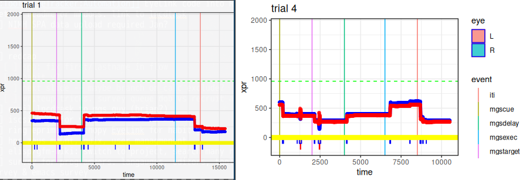

# SR Research EyeLink

also see https://github.com/samhforbes/eyetrackingr


```R
source('inspect.R')
asc_fname <- "example/sub-wf_sendmsg/ses-01/20231226_MGSEye/sub_wf_sendcmd_ses_01_task_MGS_run_1_20233426153455.asc.gz"
inspect_trial(asc_fname, 3, extract_events=extract_mgs_events)
score_file_mgs(asc_fname) %>% head
  trial dotpos dlydur   lat  nsac leftmost rightmost score desc
  <dbl>  <dbl>  <dbl> <dbl> <int>    <dbl>     <dbl> <dbl> <chr>
1     1 -0.875    7.5  1525     2     210.      408.     1 ""
2     2  0.875    2.5   212     2     387.      552.     1 ""
3     3  0.875    7.5    38     4     194.      395.    -1 "early saccade"
4     4 -0.5      2.5   304     4     375.      618.     0 ""
5     5 -0.875    2.5   200     2     187.      403.     1 ""
6     6 -0.5      7.5  1508     2     219.      407.     1 ""
```

## Extracting for R

edf binary can be converted to asc text to be read by [[`eyetracker::read.asc`][https://github.com/a-hurst/eyelinker]]
```bash
export EDFDIR=$HOME/scratch/EyeLink_LinuxDevKit_1.11_x64_debs/usr/bin/EdfConverter;
for f in /path/to/edfs/*edf; do
   LD_LIBRARY_PATH=$EDFDIR java -jar $EDFDIR/edfconverter.jar $f
   # can gzip ${f/.edf/.asc} to reduce disk usage
done
```

also see `Makefile` and [lncdtools:edf2asc](https://github.com/lncd/lncdtools/blob/master/edf2asc)

## Scoring strategies
Trials are scored based on gaze immediately after the distracting dot is displayed. Trial latency is the time from presentation to the first saccade. The direction of the first saccade determines the score: away = correct = 1, toward = incorrect = 0. A corrective saccade away from the dot after an incorrect trial is "error corrected" (score = 2) trial.

Separate files `vgs.R`, `mgs.R`, `eprime3_dollarrward.R` provide specific functions fed to generic scoring functions in `eye_functions.R`

### Eyelink saccades
Included is a naive implementation limited to the externally identified (in EyeLink edf) saccades. 

```R
run_stats(score_file(asc_fname='example/220682rr01.asc.gz'))
```

|   score  |  n|`lat_m`|`lat_sd`|
|      -1  | 20|-971.|1504. |
|       0  |  3| 476.| 376. |
|       1  | 73| 342.| 104. |
|       2  | 16| 230.|  57.5|


Despite it's simplicity, the trial scoring is reasonable.
Most trials are correct (n=`73`), many are dropped (`20`), and, of the incorrect trials (`19`), most have a correction effort (score=2, n=16).


#### TODO:
 * look at saccade start and end positions to confirm motion should count toward the given score.
 * incorporate blinks to drop trials where the onset of the dot was not seen

### asl algorithm
The algorithm used for previous studies is specific to datasets collected with the much older ASL's low temporal/low spatial resolution tracker. To work on EyeLink data, the EyeLink recordings are downsampled to 60Hz and the x/y gaze space transformed to 261x261.


I suspect this will be more rigorous than the quickly implemented method using eyelink saccades. In particularly, the ASL algorithm is more likely to better identify drop trials (blinks, missing data). There's also more logic for assessing an error corrected trial.

The latency estimates will necessarily be lower resolution (due to downsampling). But I also expect SR Research's saccade detection to be more principled. Even if the old ASL scoring is implemented for high sampling rates, I anticipate the associated latencies from EyeLink's saccades to be more accurate than those identified by the ASL algorithm.

#### data differences

Compared to ASL, EyeLink data has
  * high sampling rate
  * processed metrics in output (saccades, blinks)
  * different output (binary edf, text asc)
  * existing packages (R: `eyelinker`)

#### TODO
 - filter blinks after downsampling. Missingness in original is interpolated
 - find rectangle bounds or recording grid to resample to ASL
 - compare this scoring to just using saccades as identified in edf file
